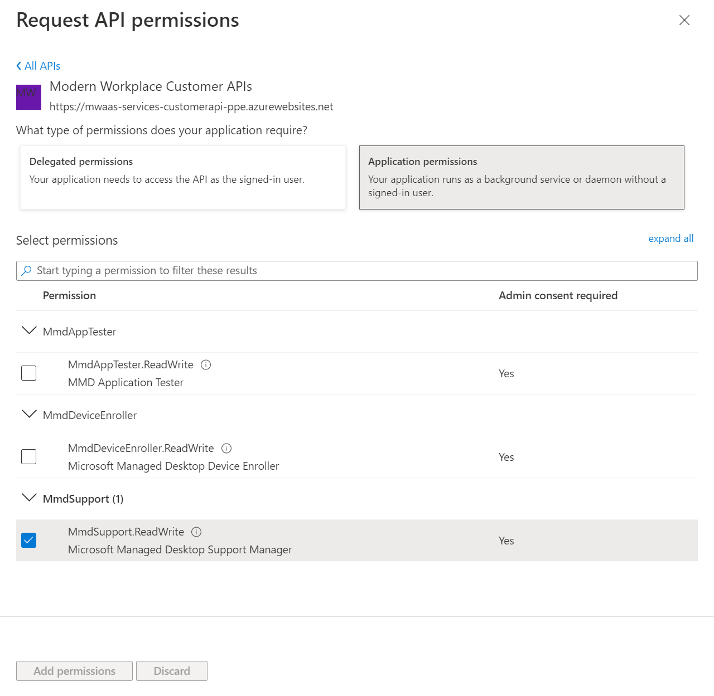

# Get access to API with application context

This article describes how to create an application to get programmatic access to Microsoft Managed Desktop API with their own identity and not on behalf of a user.

The API access requires OAuth2.0 authentication. For more information, see [OAuth 2.0 client credentials flow](/azure/active-directory/develop/v2-oauth2-client-creds-grant-flow).

**To configure a service and get an access token:**

1. Create and register [an AAD application](/graph/auth-register-app-v2).
1. Configure permissions for Microsoft Managed Desktop on your app.
1. Get administrator consent.
1. Get an access token using this application.
1. Use the token to access Microsoft Managed Desktop API.

## Create an app

To authenticate with the Microsoft identity platform endpoint, you must first register your app at the [Azure app registration portal](https://go.microsoft.com/fwlink/?linkid=2083908).

For a service that will call Microsoft Managed Desktop API under its own identity, you must register your app for the Web platform and copy the following values:

- The application ID assigned by the Azure app registration portal.
- A client (application) secret, either a password or a public/private key pair (certificate).
- A redirect URL for your service to receive token responses.

For steps on how to configure an app using the Azure app registration portal, see [Register your app](/graph/auth-register-app-v2).

With the OAuth 2.0 client credentials grant flow, your app authenticates directly at the Microsoft identity platform endpoint using the application ID assigned by Azure Active Directory and the client secret that you create using the portal.

## Configure permissions

**To configure application permissions for your app in the [Azure app registrations portal](https://go.microsoft.com/fwlink/?linkid=2083908):**

1. Under **your** application's API permissions page, choose **Add a permission \> APIs my organization uses \>** type **Modern Workplace Customer APIs \>** select **Modern Workplace Customer APIs**.
2. Select **Application permissions \> MmdSupport.ReadWrite**, and then select **Add permissions**.



## Get administrator consent

You will need an administrator to grant admin consent for your application.

## Get an access token

For more information on Azure AD tokens, see the [Azure AD tutorial](/azure/active-directory/develop/active-directory-v2-protocols-oauth-client-creds).

In the OAuth 2.0 client credentials grant flow, you use the application ID and client secret values that you saved when you registered your app to request an access token directly from the Microsoft identity platform /token endpoint.

### Token request

You send an HTTP POST request to the /token identity platform endpoint to acquire an access token:

```http
https://login.microsoftonline.com/{tenantId}/oauth2/v2.0/token
```

| Parameter  | Condition | Description |
| --- | --- | --- |
| tenantId | Required | The tenant’s Azure Active Directory Id. |
| client_id | Required | The application ID assigned when you registered your app. |
| Scope | Required | Must be `https://mwaas-services-customerapi-prod.azurewebsites.net/.default` |
| client_secret | Required | The client secret that you generated for your app in the app registration portal.|
| grant_type | Required | Must be `client_credentials`. |

### Token response

A successful JSON response looks like this:

```json
{
    "token_type": "Bearer",
    "expires_in": "3599",
    "access_token": "access_token"
}
```

| Parameter | Description |
| --- | --- |
| access_token | The requested access token. Your app can use this token in calls to the API. |
| token_type | Must be bearer. |
| expires_in | How long the access token is valid (in seconds. |

#### Use the token to access Microsoft Managed Desktop API

1. Choose the API you want to use.
2. Set the authorization header in the http request you send to "**Bearer {token}**" (Bearer is the authorization scheme).
